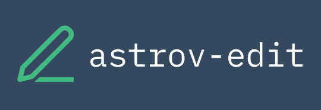

  

# astrov-edit
Text editor for Pet-project

### Features
- [Vue-3](https://vuejs.org/) and [Nuxtjs-3](https://nuxt.com/) (PWA app)
- Use [Fugu API](https://fugu-tracker.web.app/):
  - [Text Detection API](https://web.dev/shape-detection/)
  - [File system Access](https://web.dev/shape-detection/)
  - [Clipboard API](https://developer.mozilla.org/en-US/docs/Web/API/Clipboard_API)
  - [Idle Detection API](https://web.dev/idle-detection/)
  - [API EyeDropper](https://wicg.github.io/eyedropper-api/)
  - [URL protocol handler API](https://pr-preview.s3.amazonaws.com/w3c/manifest/pull/972.html#protocol_handlers-member)
  - [File Handling API](https://tinyurl.com/file-handling-design)
- [Tailwindcss](https://tailwindcss.com/)
- [Partytown](https://partytown.builder.io/)

### Fonts:
- [IBM Plex Mono](https://fonts.google.com/specimen/IBM+Plex+Mono?preview.text=astrov-edit&preview.text_type=custom)
- [Inter](https://fonts.google.com/specimen/Inter?preview.text=astrov-edit&preview.text_type=custom)

### UI libraries:
- [Component+](https://element-plus.org/)

### Tests libraries
- [Vitest](https://vitest.dev/) *for unit-tests*
- [Cypress](https://www.cypress.io/) *for E2E-tests*
## License

You can see license in LICENSE file

## Author

[@steelWinds](https://github.com/steelWinds)
